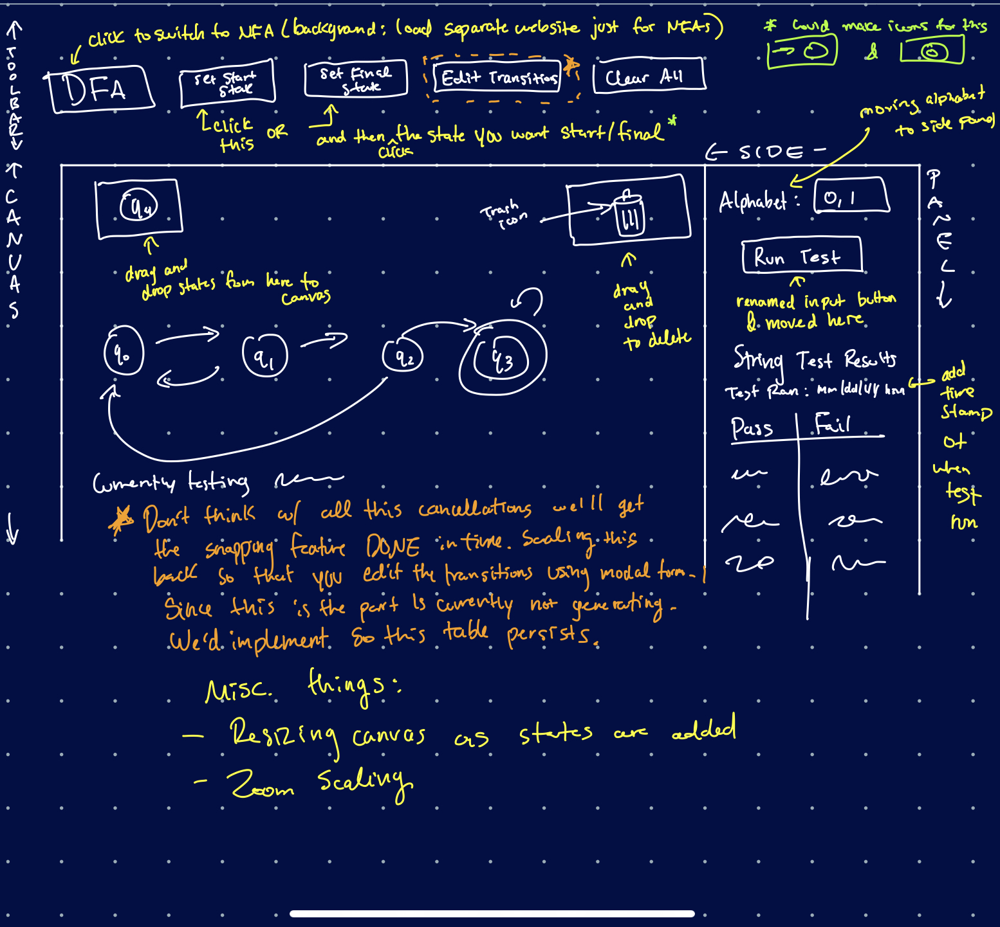

# Finite State Machine Learning Tool  
[Finite State Machines](https://brilliant.org/wiki/finite-state-machines/) (FSMs) are a staple in computer science theory. Every CS student encounters DFAs or NFAs throughout their CS degree. This is a tool designed for students & educators to aid in the understanding of automata.  

## Todo
- [] Grey out the dfa tester when dfa is not ready to be tested
- [] change the settings builder, also ensure clear all respects the changes made
- [] transition shift clicking 

## Master Plan

## Built With
* html, CSS, & Js
* [Bootstrap 4](https://getbootstrap.com) - *Web Framework*
* [JQuery](https://jquery.com) - *Js Library for html editing*  
* [p5.js](https://p5js.org) - *Js Library for drawing*

## Authors
* **Daniel Menjivar** - *Capstone Collaborator* 
* **Kyle Guieb** -  *Capstone Collaborator*   

## Acknowledgements
* **Suebsh Bhandari** - *Inital Work:* [dfadiagram](https://dfadiagram.herokuapp.com)  

* Capstone Advisor: [Dr. Jason Isaacs](http://isaacs.cs.csuci.edu/index.html) at [*California State University Channel Islands*](https://www.csuci.edu)  
